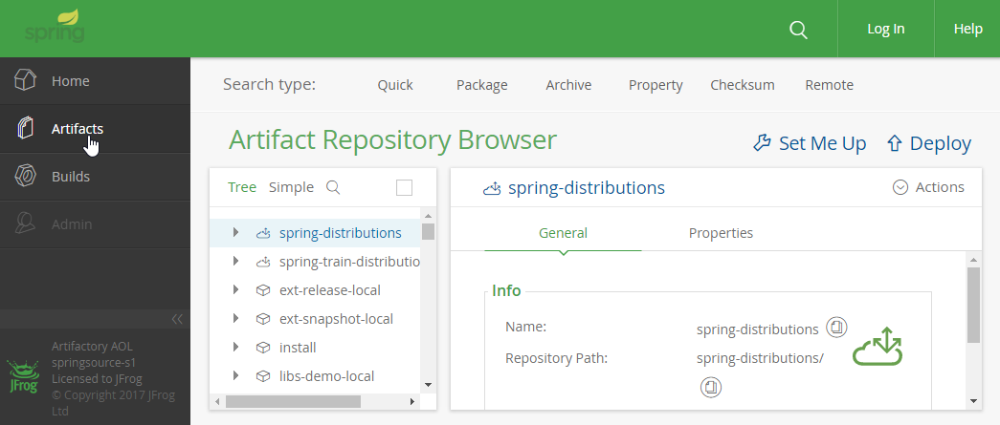

# 1. 代理（Proxy）

## 1.1 代理模式

　　代理是一种设计模式，即通过代理对象访问目标对象。示意图如下：



　　使用代理的好处是：能扩展目标对象的功能。用户通过访问代理对象来间接使用目标对象，而由代理对象提供额外的功能。

　　这样的设计符合OOP的“开闭原则”：即对象对于修改是关闭的，而对扩展是开放的。若我们直接修改目标对象的代码，则可能导致其他相关代码出现异常。

　　实现代理的关键就在于代理对象，实现的方式有静态代理和动态代理。

## 1.2 静态代理

　　静态代理是指程序运行前就已经存在代理类的字节码文件，代理类和委托类（即目标对象的类）的关系在运行前就确定了。可用接口的方式实现静态代理。

　　要求：委托类和代理类要实现相同的接口，之后代理类实现接口中方法时，可在调用委托类的方法时扩展委托类方法功能。

　　例子：UserDao的add()方法实现保存用户的功能。现在需要代理类UserDaoProxy扩展UserDao的add()方法，添加事物处理功能。

　　我们让UserDao和UserDaoProxy都实现接口IUserDao。代码如下：

　　（1）IUserDao：

```java
package com.zhang.test;

public interface IUserDao {
    void add();
}
```

　　（2）UserDao：

```java
package com.zhang.test;

public class UserDao implements IUserDao {
    @Override
    public void add() {
        System.out.println("添加了一个用户");
    }
}
```

　　（3）代理类UserDaoProxy：

```java
package com.zhang.test;

public class UserDaoProxy implements IUserDao {
    // 用于接收userDao对象
    private UserDao userDao;
    public UserDaoProxy(UserDao userDao) {
        // 用构造方法接收userDao
        this.userDao = userDao;
    }
    @Override
    public void add() {
        // 可扩展功能
        System.out.println("开启事物");
        userDao.add(); // 调用目标对象方法
        System.out.println("关闭事物");
    }
}
```

　　（4）使用代理对象：

```java
package com.zhang.test;

public class Demo {
    public static void main(String[] args) {
        IUserDao userDao = new UserDaoProxy(new UserDao());
        userDao.add();
    }
}
```

　　这样执行的就是带有事物的方法。

　　静态代理总结：

　　（1）可以在不修改委托类的前提下扩展功能。

　　（2）静态代理会导致代理类多，并且一旦修改接口，就需要修改两处代码，不利于维护。解决该问题的一个办法就是使用下面的动态代理。

## 1.3 动态代理

　　动态代理，就是在程序运行时在内存中动态地构建代理对象。动态代理可利用JDK提供的API实现，因此又叫JDK代理。需要使用的API是一个Proxy类中的静态方法：

　　public static Object newProxyInstance(ClassLoader loader, Class<?>[] interfaces,    InvocationHandler h)。其中：

　　参数1指定当前目标对象使用的类加载器；

　　参数2指定目标对象实现的接口类型；

　　参数3是事件处理器，即用于扩展代理功能。

　　该方法返回的就是一个代理对象，之后使用该对象即可。可以看出，动态代理无需代理类实现接口（但是目标类还是要实现接口），方法直接回返回代理对象。并且我们可以创建一个代理工厂类，该类中专门用于处理各种代理，便于管理。

　　在下面的例子中，就是用一个代理工厂类ProxyFactory来管理所有的代理类，类中维护的target对象就用于存储目标对象，由于该类可处理多个代理，因此目标对象类型不是确定的，因此定义为Object类型。

　　ProxyFactory代码（IUserDao和UserDao代码不变）：

```java
package com.zhang.test;

import java.lang.reflect.InvocationHandler;
import java.lang.reflect.Method;
import java.lang.reflect.Proxy;

public class ProxyFactory {
    private Object target; // 代理对象
    // 用构造传入target
    public ProxyFactory(Object target) {
        this.target = target;
    }
    // getProxyInstance()用于获得这个目标对象对应的代理对象
    public Object getProxyInstance() {
        return Proxy.newProxyInstance(
                target.getClass().getClassLoader(),
                target.getClass().getInterfaces(),
                new InvocationHandler() {
                    @Override
                    public Object invoke(Object proxy, Method method, Object[] args) throws Throwable {
                        // 这里就是进行代理的处理代码。
                        // 参数method就是目标对象对应的方法，args就是方法对应的参数
                        System.out.println("开启事物");
                        Object value = method.invoke(target, args); // 执行目标方法
                        System.out.println("结束事物");
                        return value;
                    }
                }
        );
    }
}
```

　　主类：

```java
package com.zhang.test;

public class Demo {
    public static void main(String[] args) {
        ProxyFactory pf = new ProxyFactory(new UserDao());
        IUserDao userDao = (IUserDao)pf.getProxyInstance();
        userDao.add();
    }
}
```

　　总结：使用动态代理时，会在运行时构建代理对象，因此较静态代理灵活且不用每个代理类写一个接口实现类。缺点是目标对象一定要实现接口。如果不想使用接口，还想实现代理扩展功能，那么就要用类继承的方式来实现。

## 1.4 用继承实现代理

　　比如，UserDao并没有实现接口，类中直接写好add()方法，那么如何实现代理UserDao？方法就是写一个代理类，比如UserDaoProxy，该类要继承UserDao，然后UserDaoProxy即可重写UserDao的add()方法。重写时也能调用父类UserDao的add()方法，这样就能扩展功能。

　　例如：

　　UserDao：

```java
package com.zhang.test;

public class UserDao {
    public void add() {
        System.out.println("添加了一个用户");
    }
}
```

　　UserDaoProxy：

```java
package com.zhang.test;

// 继承UserDao
public class UserDaoProxy extends UserDao {
    @Override
    public void add() {
        // 扩展功能
        System.out.println("开启事物");
        super.add();
        System.out.println("提交事物");
    }
}
```

　　主类：

```java
package com.zhang.test;

public class Demo {
    public static void main(String[] args) {
        UserDao userDao = new UserDaoProxy();
        userDao.add();
    }
}
```

　　但是使用子类代理同样会产生很多代理类，并且这个相当于“静态代理”。为了方便用继承的方式实现代理，又避免有很多类，可以用第三方类库cglib来实现代理。

## 1.5 用cglib实现代理

　　cglib代理，是在内存中构建一个子类对象从而实现对目标对象功能的扩展。我们也不需要自己写子类。使用步骤如下：

　　（1）引入cglib的jar包。可在网址：https://github.com/cglib/cglib/releases/latest 上下载最新的cglib包。我们这里使用的是“cglib-nodep-3.2.5.jar”，注意，选择的是带有“nodep”字样的包，这是不需要其他依赖包的jar包。直接引入这个即可。

　　（2）UserDao不用改变（不实现接口），我们还是用一个工厂类ProxyFactory实现代理。

　　代码如下：

```java
package com.zhang.test;

import net.sf.cglib.proxy.Enhancer;
import net.sf.cglib.proxy.MethodInterceptor;
import net.sf.cglib.proxy.MethodProxy;

import java.lang.reflect.Method;

// 实现MethodInterceptor接口
public class ProxyFactory implements MethodInterceptor {
    // 维护目标对象
    private Object target;
    public ProxyFactory(Object target) {
        this.target = target;
    }
    // 还是用getProxyInstance()方法提供代理对象
    public Object getProxyInstance() {
        Enhancer en = new Enhancer(); // 工具类
        en.setSuperclass(target.getClass()); // 设置父类
        en.setCallback(this); // 设置回调函数
        return en.create(); // 返回创建的代理对象
    }
    // 拦截器。这里写处理代理的代码
    @Override
    public Object intercept(Object o, Method method, Object[] args, MethodProxy methodProxy) throws Throwable {
        System.out.println("开始事物");
        // 执行目标对象方法
        Object value = method.invoke(target, args);
        System.out.println("提交事物");
        return value;
    }
}
```

　　主类代码：

```java
package com.zhang.test;

public class Demo {
    public static void main(String[] args) {
        UserDao userDao = (UserDao) new ProxyFactory(new UserDao()).getProxyInstance();
        userDao.add();
    }
}
```

　　实际上Cglib就是提供了类似于JDK实现接口代理的功能，只不过是用继承实现的。注意，使用继承代理时，目标类不能是用final修饰的类。

# 2. AOP

## 2.1 什么是AOP

　　AOP（aspect object programming）即“面向切面编程”。AOP的主要作用是实现“业务代码”和“关注点代码”分离。例如在利用Hibernate保存一个用户数据时，代码为：

```java
package com.zhang.test;

public class UserDao {
    // 保存一个用户
    public void add(User user) {
        Session session = null;
        Transaction trans = null;
        try {
            session = HibernateUtils.getSession();
            trans = session.beginTransaction();
            session.save(user); // 核心的业务代码
            trans.commit();
        } catch (Exception e) {
            e.printStackTrace();
            if (trans != null) {
                trans.rollback();
            }
        } finally {
            HibernateUtils.closeSession(session);
        }
    }
}
```

　　在上述代码中，其实只有“session.save(user)”这句是业务代码，而其他的代码只是编程时需要关注的代码。

　　而使用AOP就能实现“业务代码”和“关注点代码”的分离，这样做的好处有：

　　（1）因为关注点代码通常会被多次使用，因此分离后只需要写一次关注点代码；

　　（2）让开发者只关注核心的业务处理；

　　“切面”类就是指关注点代码形成的类，其中抽取了呗重复执行的代码。可使用切面类的例子有：事物、日志和权限等。

## 2.2 AOP的实现

　　AOP的实现实际上是使用了动态代理的技术。即在程序运行中，当执行到核心业务代码时，就在业务方法上动态的植入切面类代码（即关注点代码）。

　　程序怎么知道哪些业务方法需要进行AOP代理呢？因此我们需要使用“切入点”。可以通过切入点表达式来指定哪些类的哪些业务方法需要使用AOP，这样程序运行时就能为这些方法植入切面代码。

　　Spring中继承了AOP，这是一个重要的功能，因此我们下面结合Spring来实现AOP的示例。Spring中AOP使用下面方式实现动态代理：

　　（1）若目标对象实现了接口，则使用JDK代理；

　　（2）若目标对象没有实现接口，则使用cglib代理。

### 2.2.1 Spring实现AOP——注解方式

　　首先，除了要在项目中引入Spring相关的包，而且还要进入AspectJ相关的jar包。AspectJ是一个实现AOP的Java组件。下载地址：http://www.eclipse.org/aspectj/downloads.php 。解压下载的jar包，将lib目录下的“aspectjrt.jar”和“aspectjweaver.jar”两个包引入到项目中。

　　（1）在配置文件中开启注解扫描和开启AOP注解方式（需要引入aop名称空间）：

```xml
<?xml version="1.0" encoding="UTF-8"?>
<beans xmlns="http://www.springframework.org/schema/beans"
       xmlns:xsi="http://www.w3.org/2001/XMLSchema-instance"
       xmlns:context="http://www.springframework.org/schema/context"
       xmlns:aop="http://www.springframework.org/schema/aop"
       xsi:schemaLocation="http://www.springframework.org/schema/beans http://www.springframework.org/schema/beans/spring-beans.xsd http://www.springframework.org/schema/context http://www.springframework.org/schema/context/spring-context.xsd http://www.springframework.org/schema/aop http://www.springframework.org/schema/aop/spring-aop.xsd">
    <!-- 注解扫描 -->
    <context:component-scan base-package="com.zhang" />
    <!-- AOP注解方式 -->
    <aop:aspectj-autoproxy />
</beans>
```

　　（2）还是以UserDao为例。这里先用实现接口的方式。写好IUserDao和UserDao。注意将UserDao加入到容器中，因为是结合Spring的，主类需要从容器中拿到UserDao实例。

　　IUserDao：

```java
package com.zhang.test;

public interface IUserDao {
    void save();
}
```

　　UserDao：

```java
package com.zhang.test;

import org.springframework.stereotype.Component;
// 要加入容器中。这相当于把目标对象加入容器中。
// 之后Spring中配置的切面会为其中的业务方法添加切面代码。
@Component
public class UserDao implements IUserDao {
    @Override
    public void save() {
        System.out.println("保存用户");
    }
}
```

　　（3）编写切面类。主要会使用到如下注解：

　　@Aspect：在类上使用，指定该类为一个切面类。

　　@PointCut("切入点表达式")：用于声明一个切入点表达式。在一个方法上使用，方法名就可来标识这个切入点表达式。声明切入点表达式以便下述注解引用，否则下述注解均需要定义自己的切入点表达式。由于该注解只是声明一个表达式，因此他的方法只要空实现即可。

　　@Before("切入点表达式或引用@PointCut对应方法")：指定一个前置通知，用在方法上，该方法将在目标方法（切入点匹配的目标方法）之前调用。

　　@After("同上")：指定一个后置通知，用在方法上，该方法将在目标方法之后执行（无论是否出现异常都会执行）。

　　@AfterReturning("同上")：返回后通知。大体同上，只是该方法将在目标方法返回后（目标方法结束前）执行，若遇到异常则不执行。

　　@AfterThrowing("同上")：异常通知。大体同上，只是该方法在目标方法出现异常时执行。

　　@Around("同上")：环绕通知。大体同上，该方法相当于@Before和@After。

　　切面类示例：

```java
package com.zhang.test;

import org.aspectj.lang.ProceedingJoinPoint;
import org.aspectj.lang.annotation.*;
import org.springframework.stereotype.Component;

// Spring结合AOP，因此此类也要用@Component加入容器。
@Component
@Aspect // 指定为切面类
public class Aop {
    // 用@PointCut声明一个切入点表达式。对应的方法是myPointCut，空实现。
    // 这个切入点表达式就可匹配UserDao的add()方法。关于切入点表达式，下面会讲。
    @Pointcut("execution(* com.zhang.test.*.*(..))")
    public void myPointCut() {}

    // 前置通知。可引用上述声明的切入点表达式，要用对应的方法名引用
    @Before("myPointCut()")
    public void begin() {
        System.out.println("前置通知");
    }

    // 后置通知。这里就没有引用表达式，而是重新写了一遍。效果相同
    @After("execution(* com.zhang.test.*.*(..))")
    public void after() {
        System.out.println("after");
    }
    // 环绕通知
    @Around("myPointCut()")
    public void around(ProceedingJoinPoint pjp) throws Throwable {
        System.out.println("执行前..");
        pjp.proceed(); // 让目标方法执行
        System.out.println("执行后..");
    }

    @AfterReturning("myPointCut()")
    public void afterReturning() {
        System.out.println("返回后通知");
    }

    @AfterThrowing("myPointCut()")
    public void afterThrowing() {
        System.out.println("发生异常后通知");
    }
}
```

　　（4）在主类中：

```java
package com.zhang.test;

import org.springframework.context.ApplicationContext;
import org.springframework.context.support.ClassPathXmlApplicationContext;

public class Demo {
    public static void main(String[] args) {
        ApplicationContext ac = new ClassPathXmlApplicationContext("applicationContext.xml");
        // Spring管理了对象和AOP等，这里通过getBean("userDao")拿到的对象直接是植入过切面代码的对象。因为使用的是接口，所以这里拿到的对象类型是IUserDao类型，因此必须用IUserDao接收。
        IUserDao userDao = (IUserDao) ac.getBean("userDao");
        System.out.println(userDao.getClass());
        userDao.save(); // 调用save()方法
    }
}
```

　　上述就完成了一个AOP示例。我们输出userDao.getClass()时，显示的结果为“class com.sun.proxy.$Proxy12”，其类型是JDK的Proxy，说明对于实现接口的类，Spring确实是使用了JDK代理。而我们之前说过，若没有实现接口，则会使用cglib代理。为了验证，我们让UserDao不实现IUserDao接口，并且ac.getBean("userDao")的接收类型就为UserDao（其余代码无需变动）。此时发现userDao.getClass()的结果为“class com.zhang.test.UserDao$$EnhancerBySpringCGLIB$$a270ced9”，注意其中有“CGLIB”字样。说明Spring对于没有实现接口的类，确实是使用了cglib代理。但是我们并不需要在Spring中引入cglib的jar包，因为Spring中已经集成了cglib，只是包名和cglib有所差别。

　　从该例也可以感受到Spring和AOP提供的功能强大之处。以后实现代理可直接用Spring及AOP。

### 2.2.1 Spring实现AOP——XML配置方式

　　这里用XML方式配置。我们在上面代码的基础上进行改动。引入的jar包无需改动，代码也无需改动，只需要将代码中所有的注解取消掉即可（并且无需保留定义切入点表达式的方法）。接下来我们配置XML文件：

```xml
<?xml version="1.0" encoding="UTF-8"?>
<beans xmlns="http://www.springframework.org/schema/beans"
       xmlns:xsi="http://www.w3.org/2001/XMLSchema-instance"
       xmlns:context="http://www.springframework.org/schema/context"
       xmlns:aop="http://www.springframework.org/schema/aop"
       xsi:schemaLocation="http://www.springframework.org/schema/beans http://www.springframework.org/schema/beans/spring-beans.xsd http://www.springframework.org/schema/context http://www.springframework.org/schema/context/spring-context.xsd http://www.springframework.org/schema/aop http://www.springframework.org/schema/aop/spring-aop.xsd">
    <!-- 定义dao的实例 -->
    <bean id="userDao" class="com.zhang.test.UserDao" />
    <!-- 切面类 -->
    <bean id="aop" class="com.zhang.test.Aop" />
    <!-- AOP的配置 -->
    <aop:config>
        <!-- 定义切入点表达式 -->
        <aop:pointcut id="pt" expression="execution(* com.zhang.test.*.*(..))" />
        <!-- 定义各切面。ref是引用上述的aop的bean -->
        <aop:aspect ref="aop">
            <!-- 环绕通知 也可自己写pointcut属性再定义切入点表达式。这里直接引用上面的，使用pointcut-ref属性 -->
            <aop:around method="around" pointcut-ref="pt" />
            <!-- 再比如前置通知 -->
            <aop:before method="begin" pointcut-ref="pt" />
        </aop:aspect>
    </aop:config>
</beans>
```

## 2.3 切入点表达式

　　切入点表达式可以对指定的“方法”拦截，从而给方法所在的类生成代理对象。关于切入点表达式的学习，可以在Spring文档的“11.3 Schema-based AOP support”这章中详细学习（Declaring a pointcut一节）。

　　切入点表达式的格式：

```
execution(modifiers-pattern? ret-type-pattern declaring-type-pattern? name-pattern(param-pattern) throws-pattern?)
```

　　解释如下：

　　modifiers-pattern：指定方法的修饰符，支持通配符，该部分可省略。

　　ret-type-pattern：指定返回值类型，支持通配符，可使用“*”来通配所有的返回值类型。

　　declaring-type-pattern：指定方法所属的类，支持通配符，该部分可省略。

　　name-pattern：指定匹配的方法名，支持通配符，可以使用“*”来通配所有的方法名。

　　param-pattern：指定方法的形参列表，支持“\*”和“..”两个通配符。其中“\*”代表一个任意类型的参数，而“..”代表0个或多个任意类型的参数。

　　throw-pattern：指定方法声明抛出的异常，支持通配符，该部分可以省略。

　　例子：

```xml
<!-- 拦截所有的public方法 -->
<aop:pointcut id="pt1" expression="execution(public * *(..))" />
<!-- 拦截所有以save开头的方法 -->
<aop:pointcut id="pt2" expression="execution(* save*(..))" />
<!-- 拦截指定类的方法 -->
<aop:pointcut id="pt3" expression="execution(* com.zhang.UserTest.save(..))" />
<!-- 拦截指定类的所有方法 -->
<aop:pointcut id="pt4" expression="execution(* com.zhang.UserTest.*(..))" />
<!-- 拦截指定包及其子包下所有类的方法 -->
<aop:pointcut id="pt5" expression="execution(* com..*.*(..))" />
<!-- 还可使用逻辑表达式 -->
<aop:pointcut id="pt6" expression="execution(* com.zhang.UserTest.save()) || execution(* com.zhang.UserTest.delete())" />
<!-- 上述中也能使用 or。初次之外，也能使用and，但是&&必须要转义：&amp;&amp; -->
<!-- 取非使用not或者! -->
<aop:pointcut id="pt7" expression="not execution(* com.zhang.UserTest.save())" />
```

